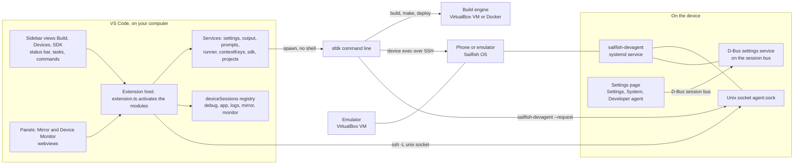
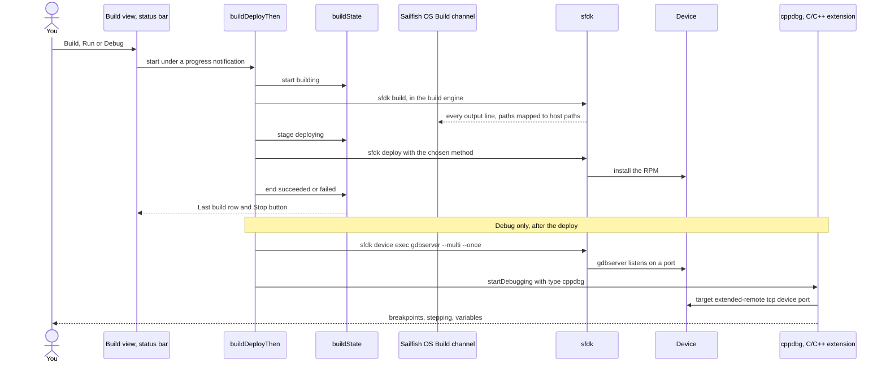
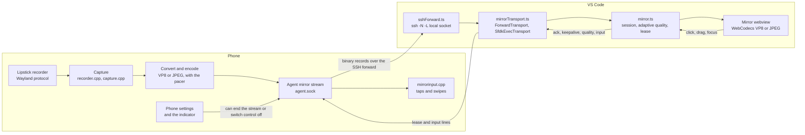
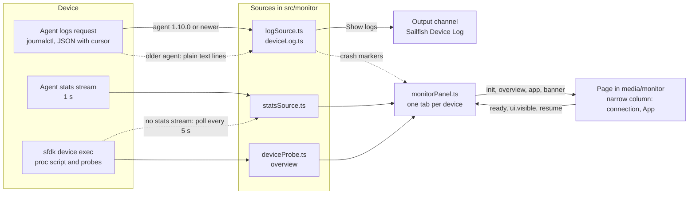

# Sailfish OS Tools

A VS Code extension for building, running and debugging Sailfish OS apps. It
finds your Sailfish SDK, lets you pick a build target and a device from the
status bar, and runs build, deploy, run and debug with one click on the
emulator or a phone. An optional helper on the phone, the **device agent**,
adds screenshots, a live system log and a screen mirror you can tap and swipe
from VS Code.

Version 0.1.7, with 0.1.8 in progress (see the
[changelog](CHANGELOG.md)). Linux and macOS. The extension is not on the Marketplace yet;
see [Part 3](#part-3-install-vs-code-and-this-extension) to build it.

> **Independent project.** This is a personal hobby project. It is not
> affiliated with, endorsed by or made for Jolla or any other company.
> Sailfish OS is a trademark of Jolla; the name is used here only to say which
> platform the extension works with.

## Features

**SDK and build targets**

- Finds the Sailfish SDK on its own (`sailfish.sdkPath`, `SAILFISH_SDK_ROOT`,
  `~/SailfishOS`, then `sfdk` on `PATH`). **Set SDK Path**, **Download SDK**
  and **Install SDK** help when it is missing.
- An **SDK** view: SDK version and location, the `sfdk` path, the build engine
  with start and stop buttons, and the installed build targets.
- Pick the build target from the status bar (**Select Target**). **Set sfdk
  Default Target** and **Set sfdk Default Device** change `sfdk`'s own defaults.
- **New Project** creates a project with `sfdk init`. A getting-started
  walkthrough covers the first steps.

**Build, deploy, run and debug**

- Status bar buttons: **Build**, **Deploy** (build and install, without
  starting), **Run** (build, install and start; **Ctrl+Alt+R**) and **Debug**.
- **Run Installed App** and **Debug Installed App** start the app that is
  already on the device, without building again. If it is not installed, they
  offer to build and deploy first.
- Release or Debug build type, six deploy methods, and a warning before
  building for another architecture on top of an old build.
- C++ debugging on the device through `gdbserver` and the C/C++ extension.
  Debug builds are unoptimised (`-O0 -g`), **Restart** (Ctrl+Shift+F5) starts
  `gdbserver` again without building, and Debug opens the Device Monitor beside
  the editor.
- Run, Debug and Deploy stream their build log live into the **Sailfish OS
  Build** channel, and a running app, log stream or mirror shows in the status
  bar and the Devices view; changing the device stops what ran on the old one.
- VS Code tasks of type `sailfish` (build, build (debug), deploy, run,
  package, check, clean) with problem matchers for gcc, qmake, rpmbuild and the
  Harbour validator.

**Package signing**

- **Set Up Package Signing** picks one of your GPG keys, or creates one, checks
  that the passphrase works, and turns on signing for the project. It saves the
  key's fingerprint, so a key with a similar name cannot be used by mistake.

**Build view**

- The **Build** view at the top of the Sailfish sidebar shows the project's
  target, device (connected or offline), build type, deploy method, signing and
  the last build (running with its stage and time, or succeeded / failed). Click a
  row to change it; the title bar has Build (Stop while a build runs) and the
  build log, and the ⋯ menu has Clean Project Build, Rebuild, Package, Validate
  RPM, Run / Debug Installed App and Set Up Package Signing.
- **Clean Project Build** deletes what an in-source build generated in the
  project folder (qmake Makefiles, object files, moc/qrc output, `RPMS`,
  `BUILD`, `BUILDROOT`) after a confirmation that lists what goes. Hand-written
  Makefiles, symlinks and `.git` are never touched. **Rebuild** cleans, then builds.

**Devices and emulators**

- One **Devices** view with two groups, **Emulators** and **Devices**: start,
  stop and show emulators, install more emulators, open an SSH terminal to a
  device.
- **Add Device** registers a phone in a few prompts: it creates an SSH key,
  copies it to the phone and registers the phone with the SDK and the build
  engine. **Remove Device** undoes it.
- **Install Deploy & Debug Tools on Device** installs `rsync`,
  `sdk-deploy-rpm` and `gdb-gdbserver` on the phone.

**Device agent: screenshots, logs, screen mirror and control**

- **Take Device Screenshot** saves a PNG where you choose and opens it.
- **Show Device Logs** streams the phone's system log into the **Sailfish
  Device Log** output channel (also reachable from the Device Monitor).
- A **Device Monitor** tab per device: connection, live app stats and actions
  (Part 11).
- **Mirror Device Screen** shows the phone's screen live in an editor tab, as
  VP8 video over an SSH forward when possible. A one-line status strip and an
  ⓘ **Mirror details** popover show the transport, codec and frame rate. With agent 1.7.0 or newer you
  can click to tap and drag to swipe while the panel has focus.
- The phone's own **Settings → System → Developer agent** page decides what
  VS Code may do (screen view, control, logs, indicator); it wins over VS Code.
- The agent is installed once, with your consent and the developer-mode
  password, and works only while Developer Mode is on. See
  [How the device agent stays safe](#how-the-device-agent-stays-safe).

**QML editing**

- 21 Silica QML snippets (`sfpage`, `sfdialog`, `sflistview`, `sfpulldown`,
  `sfcover` and more).
- Turns off the Qt QML extension's `qmlls` language server in Sailfish
  projects, where it only reports false errors (see
  [What this is not (yet)](#what-this-is-not-yet)).

## How the extension is built

This part is for readers who want to know what runs where. Every diagram shows
what the code does today; file names are under `src/` unless they start with
`device-agent/`.

### The big picture



- `extension.ts` builds one `Services` object (`core/services.ts`) and calls
  each module's `activateX(ctx, services)` in a fixed order. Nothing waits for
  `sfdk` during activation.
- Everything that touches the SDK goes through `services.runner`
  (`sfdk/runner.ts`), which starts `sfdk` with an argument list, never through a
  shell, and starts the build engine when a command needs it.
- `core/deviceSessions.ts` remembers what runs on each device. Changing the
  selected device, or **Stop Sessions on Device**, stops those sessions.
- The agent is reached two ways: one-shot requests run
  `sfdk device exec -- sailfish-devagent --request <cmd>`; the mirror uses a
  direct `ssh -N -L` forward to the agent's Unix socket. The phone's Settings
  page talks to the same agent over D-Bus and wins over VS Code (see
  [How the device agent stays safe](#how-the-device-agent-stays-safe)).

### Build, deploy and debug



- **Build**, **Deploy**, **Run** and **Debug** share `buildDeployThen`
  (`tasks/commands.ts`): checks for project, target and architecture, then
  `sfdk build`, then `sfdk deploy`, then the step that is specific to Run or
  Debug. The **Build** task (`tasks/provider.ts`) runs the same `sfdk`
  commands in a task terminal.
- When the project's `Makefile` was made for the other build type, a
  `sfdk make -- clean` runs first. Debug builds also pass the `-O0 -g` flags.
- `build/` holds the Build view and the shared `buildState` that the task, Run,
  Debug and Deploy all report to. Its Stop button cancels the same token as the
  notification's Cancel button.
- `tasks/buildLog.ts` streams the engine start, `sfdk build` and `sfdk deploy`
  into the **Sailfish OS Build** channel.
- `debug/` builds the debug configuration from `sfdk`'s own gdbserver recipe.
  **Restart** (Ctrl+Shift+F5) starts gdbserver again without building (see
  `debug/debugSessionCore.ts`); Stop cleans up and ends the sessions.
- **Clean Project Build** (`tasks/cleanProject.ts`) deletes generated files on
  the host and does not call `sfdk`.

### The screen mirror



- With the device's key registered, `sshForward.ts` starts `ssh -N -L` from a
  private local socket to the agent's socket, using only the registered key and
  the extension's own pinned known-hosts file. The agent sends binary records:
  VP8 key and delta frames, or JPEG images.
- If the forward fails, `SfdkExecTransport` runs
  `sfdk device exec -- sailfish-devagent --request mirror ...` and receives
  base64 text lines. The strip then says `Slow path`.
- The webview decodes VP8 with WebCodecs and falls back to JPEG when it
  cannot. It acknowledges each frame, so the phone stays at most a few frames
  ahead.
- Going back to the phone: acknowledgements, a keepalive every 20 s (the phone
  stops by itself after 60 s without one), quality changes from
  `mirrorAdapt.ts` and, with agent 1.7.0 or newer, tap and swipe input under a
  separate 3 s focus lease. The agent checks Developer Mode and the phone's
  Settings page on each renewal.
- On the phone, a notification says the screen is being viewed or controlled.
  The agent injects the touches itself and never grabs the touchscreen.

### The Device Monitor



- **Logs** need the agent: `logSource.ts` sends the `logs` request (JSON format
  with agent 1.10.0 or newer, plain text lines with older agents) and
  `deviceLog.ts` writes the formatted lines into the one **Sailfish Device Log**
  output channel. The monitor never reads the journal through the SSH login
  itself and has no log view of its own.
- **App** stats come from the agent's `stats` stream once a second, or, when the
  agent lacks it, from a small script run through `sfdk device exec` every
  `sailfish.monitor.pollIntervalSeconds` seconds while the tab is visible
  (`monitor/appStats.ts`).
- **Overview** comes from four short `sfdk device exec` commands, cached until
  you refresh.
- Every message from the page goes through `parsePageMessage`
  (`monitor/protocol.ts`), which accepts only known types and bounded values.

### Where things live

| Folder | What it owns |
|---|---|
| `src/extension.ts` | Activation: creates the services and activates every module in a fixed order. |
| `src/core/` | `services.ts` (the container), `output.ts` (the **Sailfish OS** channel), `contextKeys.ts`, `deviceSessions.ts` (what runs on which device), external tool checks. |
| `src/settings/` | The `sailfish.*` settings, their defaults and change dispatch. |
| `src/sfdk/` | Finding the SDK, running `sfdk` (`runner.ts`), parsing its output, **Download SDK**. |
| `src/project/` | Detecting Sailfish projects and reading the `.spec` file. |
| `src/targets/` | The target picker and the status bar item. |
| `src/tasks/` | Build, deploy, run, package and clean tasks, the build and run commands, signing, argument building, path mapping, the build log, the build and device status bar items. |
| `src/build/` | The **Build** view and the shared build state. |
| `src/debug/` | Debug on Device: gdbserver recipe, `cppdbg` configuration, Restart handling. |
| `src/devices/` | The **Devices** view, Add Device, `devices.xml`, key push, reachability, SSH launch, clean-up on device change. |
| `src/agent/` | Installing and talking to the device agent; the mirror (`mirror*.ts`, `sshForward*.ts`). |
| `src/monitor/` | The Device Monitor: panel, sources, models and `webview/` page code. |
| `src/wizard/`, `src/walkthrough/`, `src/qtqml/`, `src/ui/` | New Project, the getting-started walkthrough, turning off `qmlls` in Sailfish projects, prompt helpers. |
| `media/` | The icon, the walkthrough text and the agent RPMs in `media/agent/<arch>/`. |

Most folders keep the logic that needs no VS Code in `*Core.ts` files, so the
unit tests run them without a VS Code window.

| In `device-agent/` | What it does |
|---|---|
| `src/main.cpp`, `agent.*` | The binary: `--daemon` (the service and its socket) or `--request <cmd>` (the client, in `client.*`). Request parsing and the Developer Mode check. |
| `src/screenshot.*`, `logs.*`, `stats.*` | Screenshots through Lipstick, `journalctl` streaming, and per-app `/proc` statistics. |
| `src/mirror.*`, `recorder.*`, `capture.*`, `videoencoder.*`, `pacer.h` | The mirror stream: Lipstick recorder, capture path, VP8 and JPEG encoding, frame pacing. |
| `src/mirrorinput.*`, `touchoverlay.*` | Tap and swipe injection and the touch indicator. |
| `src/indicator.*` | The notification shown while the screen is viewed or controlled. |
| `src/settings.*`, `settingsservice.*` | The phone's own settings file and the D-Bus service the Settings page uses. |
| `settings/DeveloperAgentPage.qml` | The **Developer agent** page in Settings, System. |
| `sailfish-devagent.service`, `rpm/`, `sailfish-devagent.pro` | The systemd unit and the RPM spec. |
| `build.sh` | Builds the RPMs for `aarch64`, `armv7hl` and `i486` and copies them to `media/agent/`. |

## Words used below

| Term | Meaning |
|---|---|
| **Sailfish SDK** | Jolla's toolkit for building Sailfish OS apps. It installs into `~/SailfishOS`. |
| **`sfdk`** | The SDK's command-line tool. The extension runs it for you; you can also run it in a terminal. |
| **Build engine** | A virtual machine (VirtualBox) or container (Docker) where the SDK compiles your app. It starts by itself when needed. |
| **Build target** | The Sailfish OS version and processor type you compile for, e.g. `SailfishOS-5.1.0.11-aarch64`. |
| **Architecture** | The end of a target name: `aarch64` (64-bit ARM phones), `armv7hl` (32-bit ARM phones) or `i486` (the emulator). |
| **Emulator** | A Sailfish OS phone running as a VirtualBox virtual machine on your computer. |
| **Device** | A phone or the emulator that the SDK installs your app on. |
| **RPM** | The package format Sailfish OS installs apps from. A build puts `.rpm` files in the project's `RPMS/` folder. |
| **SDK workspace** | The folder the build engine can see, by default your home directory. Projects must be inside it. |
| **Device agent** | `sailfish-devagent`, a small service this extension can install on a device for screenshots, logs and the mirror. |

## Requirements

| What | Version | Notes |
|---|---|---|
| Computer | Linux or macOS | **Windows is not supported.** The `sailfish.experimental.enableWindows` setting only lifts the Windows block and looks for the SDK in `C:\SailfishOS`; nothing else is implemented or tested, so leave it off. |
| Free disk space | about 15 GB | For the SDK with its default components. |
| Memory | 4 GB or more | Recommended by the SDK. |
| [VirtualBox](https://www.virtualbox.org/wiki/Downloads) | 6.1 or newer | **Install before the SDK.** Needed for the emulator, and for the build engine unless you choose Docker. Tested with 7.2.20. |
| [Sailfish SDK](https://docs.sailfishos.org/Tools/Sailfish_SDK/Installation/) | 3.10 or newer | Tested with **3.13.5**. Older versions are not blocked; a warning goes to the **Sailfish OS** output channel. |
| [VS Code](https://code.visualstudio.com/) | 1.94 or newer | |
| [Qt QML](https://marketplace.visualstudio.com/items?itemName=theqtcompany.qt-qml) extension | any | Installed together with this extension (needs access to the Marketplace; VSCodium users install it from Open VSX first). |
| OpenSSH client | 8.4 or newer | `ssh`, `ssh-keygen` and `ssh-copy-id`, for **Add Device** and the fast screen mirror. The extension checks for them at start and shows a notice if any is missing. |
| GnuPG | any | Only for package signing. |
| git and [Node.js](https://nodejs.org/) | Node.js 22 or newer | Only to build the extension from source. Tested with 22.23.3. |

## Setup

Each part ends with a **Check:**. Do not go on until it passes. Parts 1 to 6
get you running on the emulator; Parts 7 to 10 add a phone, debugging, signing
and the device agent.

### Part 1: Install VirtualBox

1. Install VirtualBox 6.1 or newer from
   <https://www.virtualbox.org/wiki/Downloads> (on Linux, the package for your
   distribution; Ubuntu and elementary OS can use Oracle's `.deb`).
2. **Check:** `VBoxManage --version` prints a version such as `7.2.20r175154`.

### Part 2: Install the Sailfish SDK

1. Download the Linux installer from
   <https://docs.sailfishos.org/Tools/Sailfish_SDK/#latest-sdk-release>, named
   like `SailfishSDK-3.13.5-linux64-online.run`.
2. Start it as your normal user (not root):

   ```sh
   chmod +x ~/Downloads/SailfishSDK-3.13.5-linux64-online.run
   ~/Downloads/SailfishSDK-3.13.5-linux64-online.run
   ```

3. In the installer, keep the folder `~/SailfishOS`, choose **VirtualBox** as
   the build engine (or Docker; the emulator still uses VirtualBox), keep the
   default workspace (your home directory) and the default components. It
   downloads several GB.
4. When it finishes it opens **Qt Creator**. **Close it.** While Qt Creator
   runs it can overwrite the SDK's device list (see Part 7).
5. Make `sfdk` a plain command, as the SDK documentation recommends:

   ```sh
   mkdir -p ~/.local/bin
   ln -s ~/SailfishOS/bin/sfdk ~/.local/bin/sfdk
   ```

   Open a new terminal. If `sfdk` is still not found, add
   `export PATH="$HOME/.local/bin:$PATH"` to `~/.bashrc` or `~/.zshrc`.
6. **Check:**

   ```sh
   sfdk --version              # first line: SDK_RELEASE=3.13.5
   sfdk tools target list      # e.g. SailfishOS-5.1.0.11-aarch64, -armv7hl, -i486
   ```

   The first command that needs the build engine starts it, which takes a
   minute.

If the SDK is somewhere other than `~/SailfishOS`, set `sailfish.sdkPath` in
VS Code, or the `SAILFISH_SDK_ROOT` environment variable, to that folder.

### Part 3: Install VS Code and this extension

1. Install VS Code, git and Node.js 22 or newer. **Check:** `code --version`,
   `git --version` and `node --version` each print a version.
2. Build and install the extension:

   ```sh
   git clone https://github.com/minhdangphuoc/vscode-sailfish.git
   cd vscode-sailfish
   npm ci                                         # install build tools
   npm run build                                  # compile into dist/
   npx vsce package                               # creates sailfish-tools-0.1.7.vsix
   code --install-extension sailfish-tools-0.1.7.vsix
   ```

   The last command also installs the Qt QML extension. The package includes
   the device agent RPMs for `aarch64`, `armv7hl` and `i486`.
3. **Check:** `code --list-extensions | grep -iE 'sailfish|qt-qml'` lists
   `sailfish-tools-dev.sailfish-tools` and `theqtcompany.qt-qml`.

To update later: `git pull`, then repeat the last four commands.

### Part 4: Create or open a project

1. Projects must be inside the SDK workspace (your home directory by default).
   Outside it, every `sfdk` command fails with "The command needs to be used
   under Sailfish SDK workspace". The path must not contain spaces either; the
   extension warns if it does.
2. Create a project, either in VS Code with **Ctrl+Shift+P** (**Cmd+Shift+P**
   on macOS) → **Sailfish: New Project**, or in a terminal:

   ```sh
   mkdir -p ~/Projects/harbour-myapp && cd ~/Projects/harbour-myapp
   sfdk init -t qtquick2app
   ```

   App names start with `harbour-` by Sailfish convention.
3. Open the folder in VS Code (**File → Open Folder**) and choose **Yes, I
   trust the authors**. In Restricted Mode the extension stays off.
4. **Check:** a Sailfish icon appears in the activity bar on the left, and the
   status bar shows the items in Part 5. A folder counts as a Sailfish project
   only if it contains `rpm/*.spec`.

### Part 5: The status bar

From left to right:

| Item | What it is | Click to |
|---|---|---|
| `SailfishOS-5.1.0.11-aarch64` | Build target | Pick a target. Its architecture must match the device: `i486` for the emulator, `aarch64` or `armv7hl` for a phone. |
| 📱 `Jolla Phone` | Deploy device | Pick the device. Shows ⚠ if the SDK does not know the device, and `(offline)` if it does not answer. |
| ⚙ `Release` | Build type | Switch between Release and Debug (`sfdk build --enable-debug`, compiled without optimisation). |
| ☁ `RPM` | Deploy method | Pick how the app gets onto the device (below). |
| 🔧 | Build | Build the project. |
| 📦 `Deploy` | Deploy | Build and install on the device, without starting the app. |
| ▶ `Run` | Run | Build, install and start the app (**Ctrl+Alt+R**, **Cmd+Alt+R** on macOS). |
| 🐞 `Debug` | Debug | Build, install and start the app under the debugger (Part 8). |

To start or debug what is already installed without building again, use
**Sailfish: Run Installed App** or **Sailfish: Debug Installed App** from the
Command Palette.

Deploy methods:

| Choice | What happens |
|---|---|
| **Deploy as RPM package** (default) | Copies the RPM to the device and installs it. Needs Developer Mode. |
| **Deploy by copying binaries** | Copies the built files to `/opt/sdk/<name>` without installing an RPM. |
| **Copy RPM for manual install** | Copies the RPM to `~/RPMS` on the device for you to install. **Run** stops after copying. |
| Install RPM with pkcon / zypper / zypper dup | Other installers; zypper needs zypper and root on the device. |

When you press **Run**, the progress notification closes once the app has
started. The app runs in its own terminal, named after the app, which shows its
output. Press **Ctrl+C** there, or close the terminal, to stop it.

**Changing architecture:** projects build in place, so building for another
architecture on top of the old build gives a broken package. When you pick a
target with a different architecture, the extension asks to clean first;
answer **Clean**. Set `sailfish.build.cleanOnArchChange` to `true` to clean
without asking.

**OS versions:** a target may be older than the phone's Sailfish OS; this is
normal. As of SDK 3.13.5 the newest targets are 5.1.0.11, and their apps run on
Sailfish OS 5.2 phones.

### Part 6: Run on the emulator

1. Click the Sailfish icon in the activity bar. In the **Devices** view under **Emulators**, start
   `SailfishOS-5.1.0.11` with its start button. A phone-shaped window opens;
   wait for the home screen.
2. In the status bar, pick an `…-i486` target and the device
   `Sailfish OS Emulator 5.1.0.11`.
3. Press ▶ **Run**.
4. **Check:** your app opens in the emulator window.

The **SDK** view in the same sidebar shows the SDK version and location, the
`sfdk` path, the build engine (with start and stop buttons) and the installed
targets, with ✓ on the selected one. It does not update by itself when
something changes outside VS Code, such as the engine starting during a build;
press the view's **Refresh** button. If no SDK is found, it shows **Sailfish
SDK not found**; click it to open the install guide.

### Part 7: Run on a phone

1. **Turn on Developer Mode.** On the phone: **Settings → Developer tools**.
   Turn on **Developer mode** and **Remote connection**, and set a password.
   Note the password and the **USB IP address** shown there.
2. **Connect by USB** with a cable that carries data, plugged into the computer
   itself rather than a dock if you can. The phone appears as a network
   adapter. **Check:** `ping <USB IP address>` gets replies. The address is
   often `192.168.2.15`, but not always (a Jolla Phone (2026) used
   `192.168.2.16`). If the link keeps dropping, try another cable or port.
3. **Allow apps from outside the store.** On the phone: **Settings → Untrusted
   software** → turn on **Allow untrusted software**. Otherwise the phone
   refuses to install your app.
4. **Register the phone.** Close Qt Creator first; while it runs it rewrites
   the SDK's device list and would undo this. Then **Ctrl+Shift+P** →
   **Sailfish: Add Device**, and answer:

   | Prompt | Answer |
   |---|---|
   | Device name | Any name, e.g. `Jolla Phone` |
   | Host | The USB IP address from step 1 |
   | SSH port | `22` |
   | Username | `defaultuser` |
   | Device architecture | `aarch64` for 64-bit phones such as the Jolla Phone (2026), `armv7hl` for 32-bit ones. If unsure, pick one and check below. |
   | Authentication | **Generate new key (recommended)** |
   | Developer Mode password | The password from step 1 |

   The extension creates an SSH key, installs it on the phone, and registers
   the phone with the SDK and its build engine. A message confirms
   "registered and confirmed via `sfdk device list`". **Check:**

   ```sh
   sfdk device list                                # shows your phone as "hardware-device"
   sfdk device exec "<phone name>" -- uname -m     # prints aarch64 or armv7hl
   ```

   If `uname -m` prints another architecture than you chose, run
   **Sailfish: Remove Device** and add the phone again.
5. **Install the deploy and debug tools.** The SDK copies apps with `rsync`,
   installs them with `sdk-deploy-rpm` and debugs them with `gdbserver`; some
   phones have none of them. The phone downloads them from Jolla's
   repositories, so **turn on Wi-Fi or mobile data on the phone first** (the
   USB link has no internet). In the **Devices** view, right-click the phone →
   **Install Deploy & Debug Tools on Device**, and enter the developer-mode
   password when asked. To do it by hand instead, run this in the phone's
   **Terminal** app (`devel-su` needs a real terminal):

   ```sh
   devel-su sh -c 'pkcon refresh && pkcon install rsync sdk-deploy-rpm gdb-gdbserver'
   ```

   **Check:** the install reports success (by hand: `pkcon` ends with
   `Finished` and no error).
6. **Run your app.** In the status bar, pick the phone and a target with the
   architecture `uname -m` printed. Press ▶ **Run**, and confirm the install on
   the phone if it asks.
7. **Check:** your app opens on the phone.

**Open SSH to Device** (right-click the phone) and **Connect to Device (WLAN)**
open an SSH terminal to a device; you type the password there yourself.

### Part 8: Debug on the device

1. Set the build type to **Debug** (⚙ in the status bar) so breakpoints and
   variables work.
2. Set breakpoints in your C++ code by clicking left of a line number.
3. Press 🐞 **Debug**. The first time, accept installing the **C/C++**
   extension (`ms-vscode.cpptools`), which provides the debugger view. If
   `gdbserver` is missing on the device, choose **Install on device** and enter
   the developer-mode password (the phone needs internet).
4. The app starts on the device and stops at your breakpoints. Use the Run and
   Debug view to step and inspect variables and the call stack. The app's
   output is in the terminal "<app> (debug)". Stopping the debug session stops
   the app.

Tips:

- A Debug build is compiled without optimisation (`-O0 -g`), so breakpoints
  stay on their lines and local variables show their current values. `sfdk
  build -d` alone only keeps the debug info packages and still compiles with
  `-O2`, because the `%qmake5` macro passes the platform's `%optflags` to the
  compiler. The extension therefore adds
  `-- --define '__global_cflags -O0 -g …'` for Debug, which replaces only the
  generic part of `%optflags` and keeps the architecture flags; it also leaves
  out `-D_FORTIFY_SOURCE=2`, which needs optimisation. You do not need to change
  your `.pro` or `.spec`. Release builds are unchanged. Your own
  `sailfish.build.extraArgs` come after this define, so a define of your own
  wins. `Q_ASSERT` stays disabled (`QT_NO_DEBUG` is still defined), as in an
  `sfdk build -d`. CMake projects get the same flags through `%cmake`.
- qmake does not rebuild objects when only the flags change. When you switch
  between Release and Debug, the next Build, Deploy, Run or Debug first runs
  `sfdk make -- clean` if the project's `Makefile` was generated for the other
  type, so a Release package never contains unoptimised objects and a Debug
  build never reuses optimised ones. A build started outside the extension
  (`sfdk` in a terminal) is not checked.
- The debugged app is started by `gdbserver` over SSH, outside the Sailjail
  sandbox, so sandbox permission problems do not reproduce under the debugger.
- **Restart** (🔄 in the debug toolbar, **Ctrl+Shift+F5**) stops the app and
  starts the same installed build again under the debugger; breakpoints stay.
  It does not build or deploy, so code changes are not picked up. To run
  changed code, stop the session and press 🐞 **Debug** again.

**Debug Installed App** starts the app already on the device under the
debugger, without building or deploying again. QML and JavaScript debugging are not supported yet.

### Part 9: Sign packages (optional)

Signing is off by default. To turn it on for a project:

1. Install GnuPG (for example `sudo apt install gnupg`).
2. **Ctrl+Shift+P** → **Sailfish: Set Up Package Signing**. Pick a key from
   the list (each shows the end of its fingerprint), or choose **Create a new
   key** and enter a name, an optional email and a passphrase.
3. For an existing key, enter its passphrase. The extension signs a test file
   with the key and passphrase first; if that fails, nothing is saved.
4. It then sets, for this project folder, `sailfish.build.sign` to `true`,
   `sailfish.build.signingUser` to the key's **fingerprint**, and
   `sailfish.build.signingPassphraseFile` to a private file (mode 600) in the
   extension's storage, because `sfdk` reads the passphrase from a file. The
   passphrase is never stored in settings.
5. **Check:** the confirmation names the key and the end of its fingerprint.
   Build, deploy, run and package now pass `--sign` to `sfdk`. To verify an
   RPM, import the public key once and run `rpm -K`:

   ```sh
   gpg --export --armor <fingerprint> | rpm --import /dev/stdin
   rpm -K RPMS/<package>.rpm
   ```

If you set `sailfish.build.signingUser` to a name by hand, the extension looks
it up before building: a name matching exactly one key is used by its
fingerprint, and a name matching none or several keys stops the build with a
clear message (gpg matches names as substrings, so `Jane Doe` also matches
`Jane Doe Dev`).

### Part 10: Device agent (screenshots, logs and screen mirror)

The device agent is a small service you install on a device once. After that,
VS Code can take screenshots, show the system log and mirror the screen without
asking for the developer-mode password each time. It works on phones and on the
emulator. This extension includes agent **1.10.1**.

1. **Before you start:** the phone is registered (Part 7) and Developer Mode is
   on.
2. **Install the agent.** **Ctrl+Shift+P** → **Sailfish: Install Device
   Agent** (also in the device's right-click menu). Read the dialog, confirm,
   and enter the developer-mode password once.
   **Check:** **Sailfish: Device Agent Status** reports agent 1.10.0 running,
   with Developer Mode on.
3. **Take a screenshot.** **Sailfish: Take Device Screenshot**, or the camera
   button on the device in the Devices view. Choose where to save
   the PNG (the dialog remembers the folder). The picture opens in VS Code, and
   the notice offers **Reveal in folder**. If you cancel the dialog, nothing is
   saved.
4. **Read the logs.** **Sailfish: Show Device Logs** streams the device's system
   log into the **Sailfish Device Log** output channel (JSON with levels and
   tags with agent 1.10.0 or newer, plain text lines with older agents; ANSI
   colours are removed). Stop the stream with **Cancel** on the progress
   notification, or choose **Stop** when you run the command again. Changing
   the selected device also stops it.
5. **Mirror the screen.** **Sailfish: Mirror Device Screen**, or the mirror
   button on the device, opens the screen in a tab beside the editor.
   **Check:** the tab shows the current screen and follows what you do on the
   phone. If it says **Disconnected**, press **Reconnect**.
6. **Control the phone** (agent 1.7.0 or newer). When the strip does not show
   `Screenshot capture`, click the picture to tap and drag to swipe. A
   `Control` pill appears at the right of the strip while control is active
   (nothing while the mirror is view only; `Control off on phone` when the
   phone turned it off). Control works only
   while the mirror tab and the VS Code window have focus; switching away stops
   it at once. Only taps and one-finger swipes exist: no keys, text or power
   button.
7. **Remove the agent.** **Sailfish: Uninstall Device Agent** (one password
   prompt) first stops the mirror, device logs and app monitor of that device,
   then removes the package, its service, socket, settings and notifications,
   the extension's leftovers in the device user's home (`~/.cache/sailfish-tools`,
   staged screenshots, an RPM copy), and checks that nothing is left; one
   notification says what was removed and anything that is still there. A
   running Settings app is closed so the Developer agent entry disappears; if
   it still shows, **Restart Phone Session…** in that notification restarts
   the phone's user session after a confirmation (running apps close). The SDK
   tools (`rsync`, `sdk-deploy-rpm`, `gdb-gdbserver`) are not touched.

If the agent is missing, **Take Device Screenshot** and **Show Device Logs**
offer to install it.

**Updating the agent.** When the device has an older agent than this
extension includes, the mirror still opens, and VS Code shows a notice once per
device per session with **Update Device Agent**. **Device Agent Status** shows
the same. Updating asks for the password once and restarts the agent: a running
log stream ends, and an open mirror shows `connecting: the agent is being
updated` and reconnects by itself. The mirror needs agent 1.1.0, the SSH
forward 1.2.0, VP8 video 1.6.0 and control 1.7.0.

**How the mirror works.** When the device's key is registered, VS Code opens an
SSH port forward to the agent and receives VP8 video, which the tab decodes
itself; if this VS Code build cannot decode VP8, it uses JPEG images instead.
The video aims for up to 30 frames per second at 720 pixels wide and
2000 kbit/s. If the forward cannot be set up, the mirror uses the slower
connection through the SDK. The phone captures the screen with Lipstick's own
recorder, so no "Screenshot captured." notices appear. If the recorder is not
available, the agent takes a screenshot per frame instead: viewing still works,
but slower, with a notice per frame, and control stays off (Lipstick does not
report how it rotated the saved image, so taps could land in the wrong place).
Hiding the tab pauses the stream after a moment; closing it stops the stream.

**The status strip** below the picture is one line, for example `● Live · 30
fps`: a coloured dot (green live, grey waiting, red disconnected), the state,
the frame rate (`idle` while the screen is still), at most one warning, and on
the right an action button, the control pill and an ⓘ button. Everything else
is behind ⓘ.

| Strip | Meaning |
|---|---|
| `Live · 30 fps` | Streaming; the frame rate you actually get, smoothed over about a second. When the phone cannot encode 30 frames a second, it steps down to a steady 20, 15, 10 or 7.5 and back up when it can. |
| `Slow path` | The mirror uses the SDK connection instead of the fast SSH forward. The details give the reason, e.g. `ssh forward unavailable — auth`. With an outdated agent an **Update agent** button appears. |
| `Reduced for phone` | The phone could not encode fast enough, so only the size went down. |
| `Reduced for link` | A slow link made the mirror lower bitrate and size. Both reductions go back by themselves, which takes about half a minute; the level changes only while the picture changes. |
| `Screenshot capture` | The agent takes a screenshot per frame instead of using the recorder. Control needs the native recorder. |
| `N dropped` | Frames skipped because VS Code was still drawing the previous one. |
| `Control` / `Control off on phone` | Control is active; or the phone's Settings page turned it off. |
| `Paused`, `Connecting…`, `Disconnected: <reason>` | The tab is hidden, starting, or ended (press **Reconnect**). |

Only one warning shows at a time, in the order above. The ⓘ button opens
**Mirror details** (close it with ×, Escape or a click outside): Transport
(`SSH forward` or `SDK connection`), Video or Image (codec, size, target kbit/s
or JPEG quality, and why it was reduced), Received kbit/s, Frame rate, Latency
(phone to your screen), Phone time (per frame), Capture, Dropped and Control.
**Copy details** puts them on the clipboard for a bug report.

**The lease.** While the tab is visible, VS Code renews the mirror every 20
seconds. If the phone hears nothing for 60 seconds (VS Code hung, the computer
slept, the network dropped), it stops streaming by itself and the tab shows
`Disconnected` with **Reconnect**.

**On the phone,** one notification says "Screen is being viewed from VS Code"
while the mirror runs, and "Screen is being controlled from VS Code" while
control is active. It goes away shortly after the stream stops. A separate
notice says the developer agent is running.

### Part 11: Device Monitor

The Device Monitor is one narrow tab per device that shows whether the phone
or emulator is reachable and how your app is doing. It is a single column, so
it fits beside the editor.

1. **Open it.** **Ctrl+Shift+P** → **Sailfish: Open Device Monitor**, or use
   the device's context menu in the Devices view, or the link in the device's
   status bar tooltip. Pressing **Debug** opens it beside the editor without
   taking focus; turn that off with `sailfish.debug.openDeviceMonitor`.
   Opening a second time shows the tab that is already open.
2. **What it shows.**
   - **Connection:** a dot with **Connected** or **Offline**, then
     `Wi-Fi · aarch64 · OS 5.1.0.11 · agent 1.10.0` (connection, architecture,
     OS version, agent version).
   - **App:** the launched app's name, process id and mode, CPU and memory with
     a small line graph each, and `up m:ss · restarts N · crashes N`, live
     while it runs. With agent 1.10.0 it updates every second; without it,
     every 5 seconds through `sfdk`. When the app is not running the card says
     `<app> not running`.
   - **Actions** are icon buttons in the tab's title bar, not in the page:
     Restart app and Stop app (only while the app runs), Screenshot, Mirror and
     Show logs, which streams the device log into the **Sailfish Device Log**
     output channel (Part 10, step 4). They act on the monitor's device. The
     monitor has no log view and no session list of its own; the status bar
     tooltip and the Devices view list what runs on the device.
3. **Settings.** `sailfish.monitor.pollIntervalSeconds` (5, the poll interval
   without a stats stream) and `sailfish.monitor.logLines` (500, the initial
   tail of Show Device Logs).
4. **The phone decides.** If the phone turned system logs off in Settings →
   System → Developer agent, Show logs says so. Changing the selected device
   stops the monitor's stats stream and the log stream; the tab stays open and
   offers **Resume**. An unreachable device shows **Offline** with **Retry**.

## How the device agent stays safe

- **Installed only with your consent.** The install dialog explains what the
  agent does, and installing, updating and removing each need the
  developer-mode password. **Uninstall Device Agent** removes it completely.
- **Developer Mode gate.** The agent checks on every request, every mirror
  renewal and every start of control that Developer Mode is on. Turn it off and
  the agent refuses everything and ends a running mirror at its next renewal;
  turn it on and it works again without reinstalling.
- **No network listener.** The agent listens only on a private Unix socket on
  the phone (mode 0600, owned by `defaultuser`). VS Code reaches it only through
  the SSH login it already has. The fast mirror's port forward is a channel
  inside that login, using only the device's registered key; the socket on your
  computer is private to your user and removed when the tab closes.
- **Pinned host keys.** VS Code keeps its own list of device host keys, filled
  from the SDK connection, and refuses a key that changed. An emulator is
  re-trusted automatically; for a phone VS Code warns and offers **Trust New
  Key**, and uses the SDK connection until then.
- **Lease.** A mirror ends by itself 60 seconds after the last renewal, so a
  hung or disconnected computer cannot leave the screen streaming.
- **Visible on the phone.** A notification is shown while the screen is viewed,
  and control stays off until the phone has confirmed the "being controlled"
  notification.
- **Control only while focused.** Control has its own 3-second lease, renewed
  only while the mirror tab and its window have focus; losing focus, hiding or
  closing the tab stops it at once. Only bounded taps and one-finger swipes are
  accepted, rate-limited on both sides. There is no key, text, power-button or
  arbitrary input command.
- **Limited rights.** The agent runs as the normal phone user `defaultuser`,
  not root, with two extra groups: `privileged` (for screen capture) and
  `systemd-journal` (for the log). It accepts a fixed set of requests with
  checked arguments and passes nothing to a shell. It cannot run commands,
  change settings or read your files.

Details: [`device-agent/README.md`](device-agent/README.md).

## What is not verified yet

The device agent is new. These parts are built and tested on the emulator and
with test fixtures, but not yet confirmed on a real phone:

- Tap and swipe control: injection on a phone's touchscreen, all screen
  rotations, and the change of the on-phone notification to "being
  controlled". (The emulator follows the computer's mouse, so it does not prove
  this.)
- Mirror speed on a phone with agent 1.8.x: whether it holds 30 or 20 frames a
  second at 720 pixels wide. Frame rates and timings have only been measured on
  the emulator.
- Long sessions on a phone (memory over 10 minutes or more), and behaviour when
  the phone's screen turns off during a mirror.
- The Device Monitor on a phone: the journal fields an app started by
  `invoker` writes (which decide crash detection), `journalctl --output-fields`
  on the phone's systemd, and app stats on a phone. It is tested with fixtures
  only, not on the emulator or a phone.
- The monitor's four-theme check: the page has not been looked at in every
  VS Code colour theme (light, dark, high contrast light and dark).
- If the phone lacks the JPEG image plugin, the agent sends larger PNG frames
  on the JPEG path; which package provides that plugin is not known yet.

## Troubleshooting

**Build and deploy**

| What you see | Cause | Fix |
|---|---|---|
| `The command needs to be used under Sailfish SDK workspace` | The project is outside the SDK workspace. | Move it into your home directory, or change the workspace in Qt Creator's options. |
| `Cannot find real …` from the build engine | The project path contains a space. | Rename the folders so the path has no spaces. |
| `nothing provides 'libQt5Core.so.5'` | The package holds files built for another architecture. | **Sailfish: Clean**, then build again. |
| `The required configuration option 'device' is not set` | No deploy device selected. | Click the device item in the status bar. |
| `Installing untrusted software disabled`, or the install is refused as untrusted | The phone accepts only store apps. | Part 7, step 3. |
| `bash: rsync: not found` | `rsync` and `sdk-deploy-rpm` are missing on the phone. | Part 7, step 5. |
| Tools install fails, or `pkcon` exits with code 5 while downloading | The phone has no internet; the USB link does not provide it. | Turn on Wi-Fi or mobile data on the phone and try again. |
| `"<device>" is offline — connect it …` when installing tools or debugging | The phone's SSH port does not answer: unplugged, asleep, Developer Mode off, or on another Wi-Fi network. Nothing was installed. | Connect it (USB or Wi-Fi), wake it, check that its address in **Devices** is current, then **Retry**. |
| `pkcon` exits with code 4 (packages not found) | The phone's package lists are out of date. | Run `pkcon refresh` first; **Install Deploy & Debug Tools on Device** does this. |
| 🐞 Debug says gdbserver is not installed | `gdb-gdbserver` is missing on the phone. | Choose **Install on device** (the phone needs internet), or Part 7, step 5. |
| `Auth failed: Authentication token manipulation error` from `devel-su` | It ran without a terminal. | Run it in the phone's Terminal app, or use the VS Code command. |
| Signing setup says nothing was saved | The passphrase is wrong, or the key has one and none was entered. | Run **Set Up Package Signing** again with the right passphrase. |
| A signed build stops because the signing user matches no key or several keys | `sailfish.build.signingUser` holds a name that is missing or ambiguous. | Run **Set Up Package Signing**, which saves the fingerprint. |

**Devices**

| What you see | Cause | Fix |
|---|---|---|
| Phone missing from the Devices view, ⚠ on the device in the status bar | The phone is not in `sfdk device list`, e.g. because Qt Creator rewrote the list. | Close Qt Creator and register the phone again (Part 7, step 4). |
| `Fatal: '<name>' is not a known device` | The build engine's own device list (`~/SailfishOS/vmshare/devices.xml`) lacks this device. | Remove the device and add it again with **Add Device**, which updates both lists. |
| Add Device says to close Qt Creator | Qt Creator is running. | Close it and run the command again. |
| Qt Creator keeps asking for the device password | The device is set to password login there. | In Qt Creator's device settings, choose key-based authentication. |
| Phone not visible at all (`lsusb` does not list it) | Cable or port problem. | Try another data cable or USB port. |

**Device agent and mirror**

| What you see | Cause | Fix |
|---|---|---|
| `Developer Mode is off` for a screenshot or logs | The agent refuses while Developer Mode is off. | On the phone: **Settings → Developer tools** → turn on **Developer mode**. |
| The Logs section says `Logs need the device agent` | The device agent is not installed or not running, so there is no log source. | **Install Device Agent** from the button in the Logs section. |
| The agent is not installed or not running | It was never installed, was removed, or the device just restarted. | **Install Device Agent**, then **Device Agent Status**. |
| A notice offers **Update Device Agent** | The device has an older agent than this extension includes. | Choose **Update Device Agent** (one password prompt). |
| Screenshot is black or fails, or the mirror stays blank or shows an error | The screen is off or locked. | Wake and unlock the phone; the mirror recovers by itself. |
| Strip says `Slow path` and the details say `SDK connection (ssh forward unavailable — <reason>)` | The fast forward could not be set up (`auth`: key not accepted; `unreachable`; `no-host-key`; `remote-refused`). The mirror uses the SDK connection. | It works as it is. For the fast path, check the device's key in `sfdk device list`, that `ssh` is installed and that the phone answers. The **Sailfish OS** output has the full reason. The forward is tried again when you reopen the tab. |
| Warning that the device's SSH host key changed | The phone was reflashed or reset, or something else answers at its address. | If you changed the phone, choose **Trust New Key**. If not, check what is at that address. |
| Mirror says `Disconnected: replaced` | Another mirror of the same device started, e.g. in another window. The agent serves one at a time. | Press **Reconnect**, or close the other mirror. |
| Mirror says `Disconnected: … (lease expired)` | The phone got no renewal for 60 seconds (VS Code busy, computer asleep, network down). | Press **Reconnect**. |
| Mirror says `Disconnected` after the phone or network changed | The connection broke, e.g. the phone slept or left the Wi-Fi. | Wake the phone, then press **Reconnect**. |
| Mirror shows no `Control` pill | The agent is older than 1.7.0, the tab or window does not have focus, or the agent could not open the touchscreen. | Update the agent, click into the mirror tab, and check the **Sailfish OS** output for an input error. Viewing still works. |
| Strip says `Screenshot capture` and control stays off | Lipstick's recorder is not available, so the agent takes screenshots. | Viewing still works. The **Sailfish OS** output has the reason; control returns by itself when capture is `native` again. |
| Strip says `Reduced for link` | The link is too slow for full quality. | Move closer to the access point, use USB or a 5 GHz network, or ignore it; it recovers by itself. |
| Strip says `Reduced for phone` | The phone could not encode the full-size picture in time. | Close busy apps on the phone, or ignore it; it recovers by itself. |

## Known issues

- Close Qt Creator before **Add Device** or **Remove Device**. The extension
  refuses to change the device list while Qt Creator runs, because Qt Creator
  would overwrite the change.
- As of SDK 3.13.5 there is no Sailfish OS 5.2 build target; use 5.1.0.11.
- The device agent's open points are listed in
  [What is not verified yet](#what-is-not-verified-yet).

## What this is not (yet)

- **No Silica IntelliSense.** Completion, hover and diagnostics for Sailfish
  Silica QML are planned for a later version; they will read the build target
  installed on your machine, and Silica's own API data will never be bundled
  with this extension. For now the extension turns off the Qt QML extension's
  `qmlls` language server (`qt-qml.qmlls.enabled`) in each Sailfish project
  folder: `qmlls` needs Qt 6.8 or newer while Sailfish OS targets ship Qt 5.6,
  so it only reports false errors against Silica QML. Set
  `sailfish.qtqml.silenceQmlls` to `false` to keep it on.
- **No QML or JavaScript debugging**, only C++.
- **No Windows support.**

## Telemetry

**None.** This extension does not collect, send or report any usage data,
crash data or telemetry of any kind.

## Publisher

The `publisher` field in `package.json` (`sailfish-tools-dev`) is a
**placeholder**. The repository owner should set it to their real Marketplace
publisher id before any public release.

The publisher id is the owner's own; it does not stand for Jolla or any
company.

## Development

Node.js 22 or newer is required.

```sh
npm ci
npm run build          # bundle dist/extension.js with esbuild
npm run check:types
npm run lint
npm run test:unit
npm run test:fuzz
npm run test           # unit, fuzz and integration tests (opens a VS Code test window)
npm run verify         # everything above, plus manifest checks and a packaging dry run
```

To try changes without packaging, run `npm run build` (or `npm run build:watch`)
and then `code --extensionDevelopmentPath=$PWD <your-project>`. There is no
`.vscode/launch.json`, so **F5** does not work out of the box.

The device agent is a separate Qt program in `device-agent/`.
`sh device-agent/build.sh` builds its RPMs for all three architectures with the
SDK and copies them to `media/agent/`; see
[`device-agent/README.md`](device-agent/README.md) for its build needs and
protocol.

See `CONVENTIONS.md` for the module layout, stub APIs, and how tests stub UI
prompts and use the fake `sfdk` binary.

## License

GPL-3.0-or-later. See `LICENSE`.
