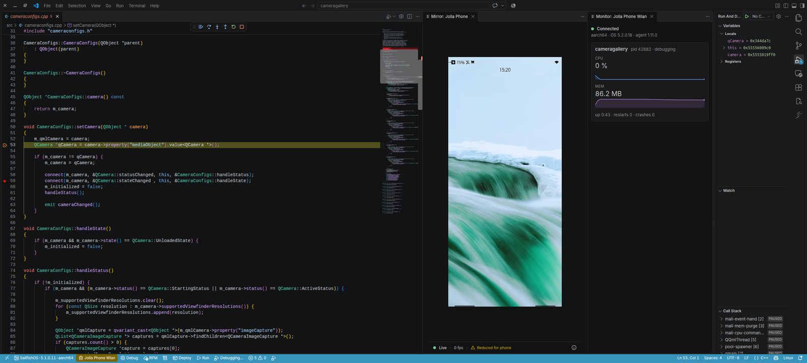

# Sailfish OS Tools

Build, run and debug Sailfish OS apps from VS Code.

> **Independent project.** This is a personal hobby project. It is not
> affiliated with, endorsed by or made for Jolla or any other company.
> Sailfish OS is a trademark of Jolla; the name is used here only to say
> which platform the extension works with.

## What it does

A VS Code extension that connects to the Sailfish SDK so you can develop
on a device or the emulator without leaving the editor.

- Build, deploy, run and debug your app with status bar buttons.
- Debug C++ on the device with gdbserver.
- Mirror the device screen live, with touch and keypad control.
- Stream device logs into VS Code.
- Device Monitor tab: connection, CPU, memory, crashes per device.
- Phone-side settings for screen view, control and logs.
- Clean install and uninstall of the device agent; nothing left behind.
- Silica QML snippets and no telemetry.

## Quick start

1. Install [VirtualBox](https://www.virtualbox.org/wiki/Downloads) and the
   [Sailfish SDK](https://docs.sailfishos.org/Tools/Sailfish_SDK/Installation/)
   (3.10+). VS Code 1.94+, Linux or macOS.
2. Install the extension from its `.vsix` file (see [Setup](docs/setup.md)).
3. Open a Sailfish project folder.
4. Pick a build target and a device in the status bar.
5. Click **Run** (Ctrl+Alt+R) or **Debug**.

## Documentation

- [Features](docs/features.md) -- everything the extension does.
- [Setup](docs/setup.md) -- from VirtualBox to package signing.
- [Device agent](docs/device-agent.md) -- screenshots, logs, screen mirror
  and how it stays safe.
- [Device Monitor](docs/device-monitor.md) -- the per-device tab.
- [Troubleshooting](docs/troubleshooting.md) -- common errors and known
  issues.
- [Architecture](docs/architecture.md) -- how the extension is built.
- [Development](docs/development.md) -- build from source and run the tests.
- [Changelog](CHANGELOG.md)

## What's next

- Silica QML IntelliSense, planned for 0.1.12.
- QML and JavaScript debugging, planned for 0.1.13.
- Profiling (CPU, memory, QML) in a later version.

## Status

Version 0.1.11. Linux and macOS; Windows is not supported. Not on the
VS Code Marketplace yet.

## License

GPL-3.0-or-later. See [LICENSE](LICENSE).

Published by `sailfish-tools-dev`, a placeholder id that does not stand for
Jolla or any company.
