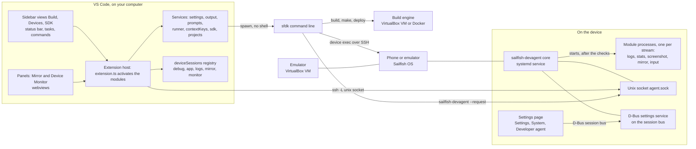
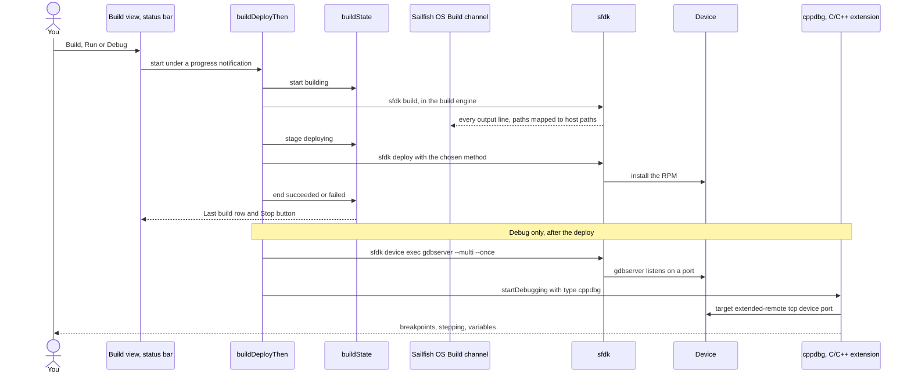
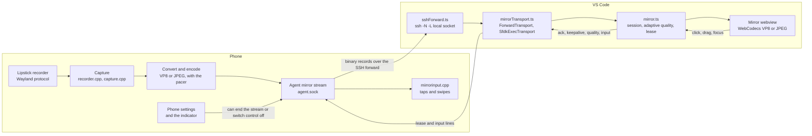
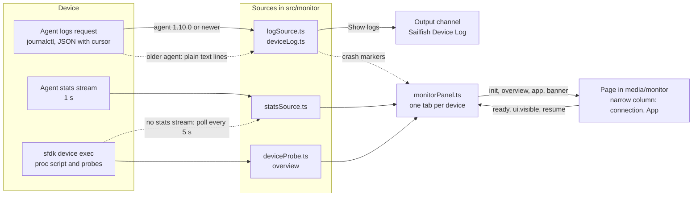

# How the extension is built

This part is for readers who want to know what runs where. Every diagram shows
what the code does today; file names are under `src/` unless they start with
`device-agent/`.

## The big picture

- `extension.ts` builds one `Services` object (`core/services.ts`) and calls
  each module's `activateX(ctx, services)` in a fixed order. Nothing waits for
  `sfdk` during activation.
- Everything that touches the SDK goes through `services.runner`
  (`sfdk/runner.ts`), which starts `sfdk` with an argument list, never through a
  shell, and starts the build engine when a command needs it.
- `core/deviceSessions.ts` remembers what runs on each device. Changing the
  selected device, or **Stop Sessions on Device**, stops those sessions.
- On the device the agent is one small core plus one package per feature (a
  module). The core owns the socket, the checks and the Settings page; a module
  runs as its own short-lived process, only while its request or stream runs.
- The agent is reached two ways: one-shot requests run
  `sfdk device exec -- sailfish-devagent --request <cmd>`; the mirror uses a
  direct `ssh -N -L` forward to the agent's Unix socket. The phone's Settings
  page talks to the same agent over D-Bus and wins over VS Code (see
  [How the device agent stays safe](device-agent.md#how-the-device-agent-stays-safe)).

## Build, deploy and debug

- **Build**, **Deploy**, **Run** and **Debug** share `buildDeployThen`
  (`tasks/commands.ts`): checks for project, target and architecture, then
  `sfdk build`, then `sfdk deploy`, then the step that is specific to Run or
  Debug. The **Build** task (`tasks/provider.ts`) runs the same `sfdk`
  commands in a task terminal.
- When the project's `Makefile` was made for the other build type, a
  `sfdk make -- clean` runs first. Debug builds also pass the `-O0 -g` flags.
- `build/` holds the Build view and the shared `buildState` that the task, Run,
  Debug and Deploy all report to. Its Stop button cancels the same token as the
  notification's Cancel button.
- `tasks/buildLog.ts` streams the engine start, `sfdk build` and `sfdk deploy`
  into the **Sailfish OS Build** channel.
- `debug/` builds the debug configuration from `sfdk`'s own gdbserver recipe.
  **Restart** (Ctrl+Shift+F5) starts gdbserver again without building (see
  `debug/debugSessionCore.ts`); Stop cleans up and ends the sessions.
- **Clean Project Build** (`tasks/cleanProject.ts`) deletes generated files on
  the host and does not call `sfdk`.

## The screen mirror

- With the device's key registered, `sshForward.ts` starts `ssh -N -L` from a
  private local socket to the agent's socket, using only the registered key and
  the extension's own pinned known-hosts file. The agent sends binary records:
  VP8 key and delta frames, or JPEG images.
- If the forward fails, `SfdkExecTransport` runs
  `sfdk device exec -- sailfish-devagent --request mirror ...` and receives
  base64 text lines. The strip then says `Slow path`.
- The webview decodes VP8 with WebCodecs and falls back to JPEG when it
  cannot. It acknowledges each frame, so the phone stays at most a few frames
  ahead.
- Going back to the phone: acknowledgements, a keepalive every 20 s (the phone
  stops by itself after 60 s without one), quality changes from
  `mirrorAdapt.ts` and, with agent 1.7.0 or newer, tap and swipe input under a
  separate 3 s focus lease. The agent checks Developer Mode and the phone's
  Settings page on each renewal.
- On the phone, a notification says the screen is being viewed or controlled.
  The agent injects the touches itself and never grabs the touchscreen.

## The Device Monitor

- **Logs** need the agent: `logSource.ts` sends the `logs` request (JSON format
  with agent 1.10.0 or newer, plain text lines with older agents) and
  `deviceLog.ts` writes the formatted lines into the one **Sailfish Device Log**
  output channel. The monitor never reads the journal through the SSH login
  itself and has no log view of its own.
- **App** stats come from the agent's `stats` stream once a second, or, when the
  agent lacks it, from a small script run through `sfdk device exec` every
  `sailfish.monitor.pollIntervalSeconds` seconds while the tab is visible
  (`monitor/appStats.ts`).
- **Overview** comes from four short `sfdk device exec` commands, cached until
  you refresh.
- Every message from the page goes through `parsePageMessage`
  (`monitor/protocol.ts`), which accepts only known types and bounded values.

## Where things live

| Folder | What it owns |
|---|---|
| `src/extension.ts` | Activation: creates the services and activates every module in a fixed order. |
| `src/core/` | `services.ts` (the container), `output.ts` (the **Sailfish OS** channel), `contextKeys.ts`, `deviceSessions.ts` (what runs on which device), external tool checks. |
| `src/settings/` | The `sailfish.*` settings, their defaults and change dispatch. |
| `src/sfdk/` | Finding the SDK, running `sfdk` (`runner.ts`), parsing its output, **Download SDK**. |
| `src/project/` | Detecting Sailfish projects and reading the `.spec` file. |
| `src/targets/` | The target picker and the status bar item. |
| `src/tasks/` | Build, deploy, run, package and clean tasks, the build and run commands, signing, argument building, path mapping, the build log, the build and device status bar items. |
| `src/build/` | The **Build** view and the shared build state. |
| `src/debug/` | Debug on Device: gdbserver recipe, `cppdbg` configuration, Restart handling. |
| `src/devices/` | The **Devices** view, Add Device, `devices.xml`, key push, reachability, SSH launch, clean-up on device change. |
| `src/agent/` | Installing and talking to the device agent; the mirror (`mirror*.ts`, `sshForward*.ts`). |
| `src/monitor/` | The Device Monitor: panel, sources, models and `webview/` page code. |
| `src/qml/` | QML completion, hover and error checks: parsers for `qmldir`, `*.qmltypes` and `.qml`, the lazy type index of the build target, `features.ts` (no VS Code) and `index.ts` (providers). |
| `src/wizard/`, `src/walkthrough/`, `src/qtqml/`, `src/ui/` | New Project, the getting-started walkthrough, turning off `qmlls` in Sailfish projects, prompt helpers. |
| `media/` | The icon, the walkthrough text and the agent RPMs in `media/agent/<arch>/`. |

Most folders keep the logic that needs no VS Code in `*Core.ts` files, so the
unit tests run them without a VS Code window.

| In `device-agent/` | Package | What it does |
|---|---|---|
| `core/`, `common/` | `sailfish-devagent` (98 KB) | The resident service and the `--request` client: socket, request parsing, Developer Mode and phone-switch checks, starting module processes, the phone's settings and their D-Bus service, notifications, the stream indicator. Links only QtCore, QtDBus and QtNetwork. |
| `logs/` | `-logs` (38 KB) | `journalctl` streaming. |
| `stats/` | `-stats` (42 KB) | Per-app `/proc` statistics for the Device Monitor. |
| `screenshot/` | `-screenshot` (37 KB) | One screenshot through Lipstick. |
| `mirror/` | `-mirror` (101 KB) | The mirror stream: Lipstick recorder, VP8 and JPEG encoding, frame pacing. The only module that loads QtGui, Wayland and libvpx. |
| `input/` | `-input` (60 KB) | Tap, swipe and key injection and the touch indicator; needs `-mirror`. |
| `settings/DeveloperAgentPage.qml` | core | The **Developer agent** page in Settings, System. |
| `sailfish-devagent.service`, `rpm/`, `sailfish-devagent.pro` | | The systemd unit, the one RPM spec for all six packages, the qmake project. |
| `build.sh` | | Builds the six RPMs for `aarch64`, `armv7hl` and `i486` and copies them to `media/agent/`. |

RPM sizes are for `aarch64`.

